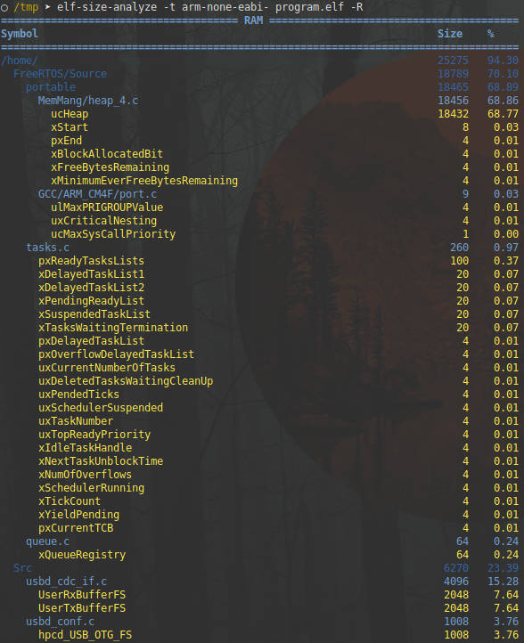

# Elf size report

This script is based on [size_report](https://github.com/zephyrproject-rtos/zephyr/blob/master/scripts/footprint/size_report) from Zephyr Project scripts. It has been almost fully rewritten but the idea is the same. It uses binutils programs (readelf, nm, c++filt) to extract information about symbols and sections from an ELF file and filters them. Information is presented in a tree based on paths to files where the symbols have been defined.

Requires Python 3, readelf, nm and (optional) c++filt. To be able to extract path information about symbols from ELF file, the program should be compiled with debug information.

Use `python elf-size-analyze.py -h` for usage info. 

